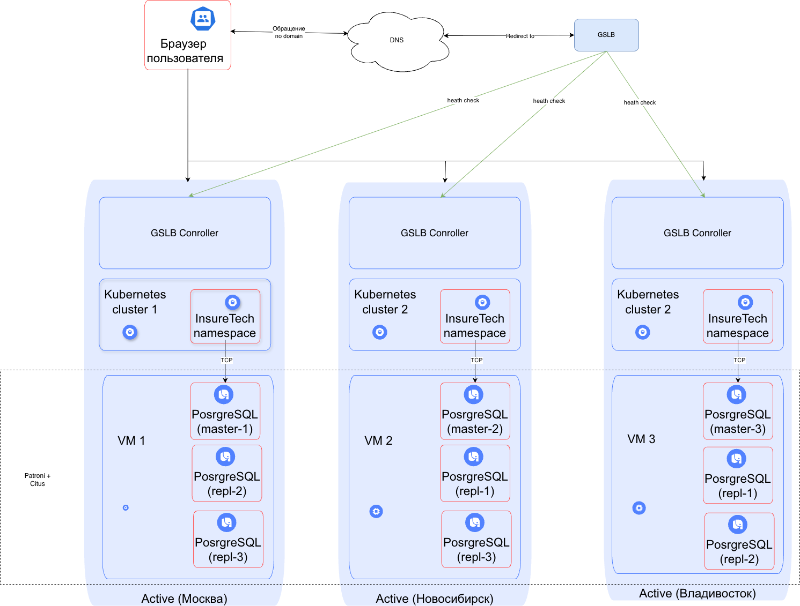

## Стратегия масштабирования и отказоустойчивости 

Для решения задачи будет использоваться 3 кластера k8s. Каждый кластер будет работать по схеме Active-Active
и расположен в отдельном регионе (МСК, НСК, Владивосток) для георезервирования. Внутри кластера будет реализовано
горизонтальное масштабирование с автоскейлом.

Такой сетап:
- Обеспечит одинаковое время ответа для всех пользователей; 
- Сможет выдержать выход из строя одного из кластеров без значительного влияния на пользователей;

## Балансировка нагрузки

Балансировка нагрузки между кластерами будет осуществляться средствами GSLB.
Внутри кластера будет несколько инстансов приложения, распределение между ними будет идти стандартными средствами
k8s. 

## Фейловер-стратегия

В случая выхода одного из кластеров, GSLB перенаправит трафик на другой.
В кластере будет автоскейлер, который увидит повышенную нагрузку и отскейлится.

## Конфигурация базы данных.

В каждом дата центре будет собственный мастер (шард), который будет асинхронно реплицироваться в два других кластера. 
Каждые 15 минут будет происходить резервное копирование данных. 

Для реализации будем использовать patroni + citus.

