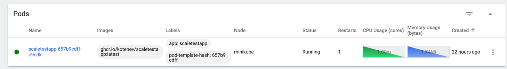
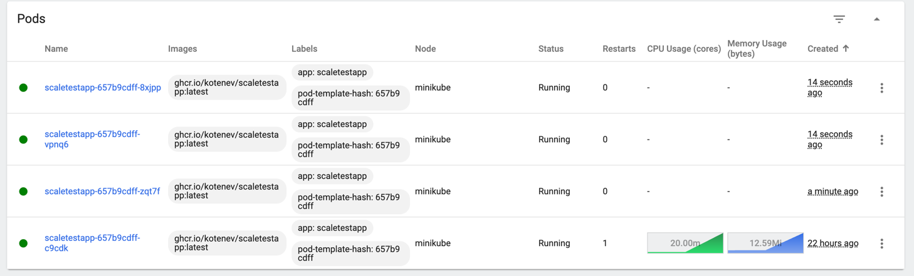
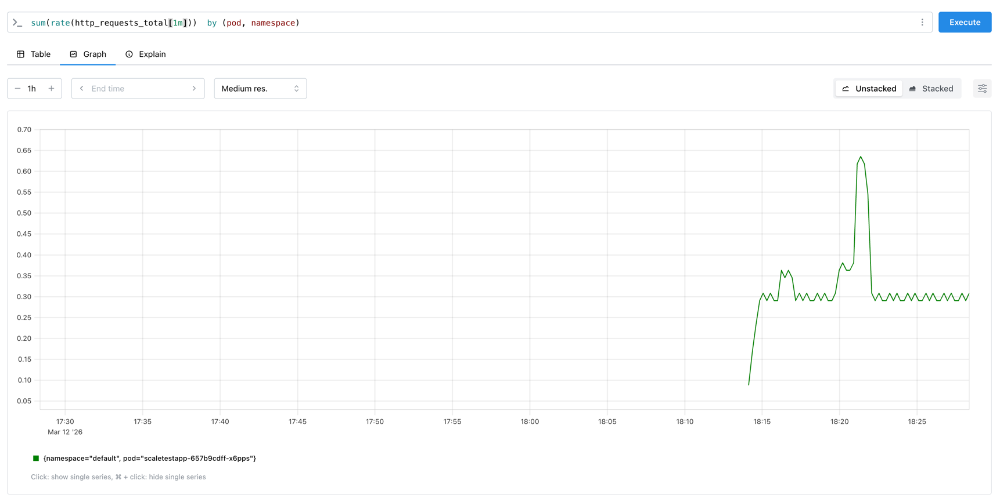
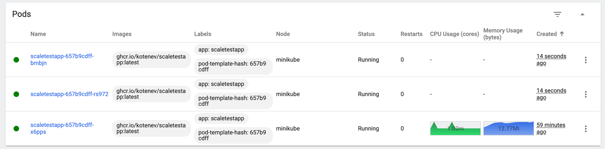
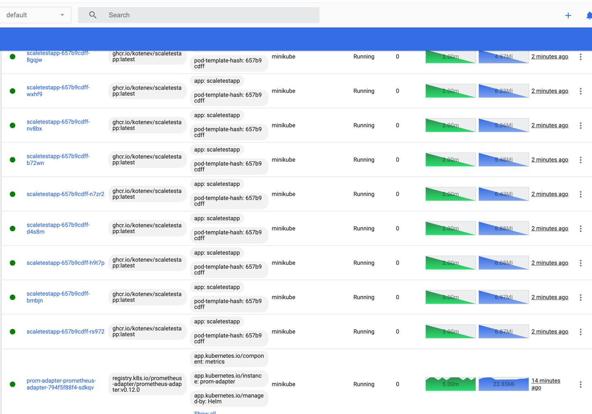
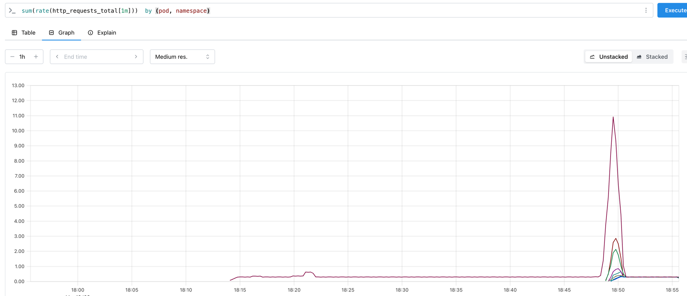

# Инструкция

## Часть 1

Команды для запуска. Больше для себя, чтобы понимать, как воспроизвести:

```
minikube start --driver=docker
minikube addons enable metrics-server

kubectl apply -f deployment.yaml
kubectl apply -f service.yaml
kubectl apply -f hpa.yaml

minikube dashboard

minikube service scaletestapp --url

locust
```

До запуска locust: 



После:



## Часть 2

Команды для запуска. Больше для себя, чтобы понимать, как воспроизвести:

```
helm repo add prometheus-community https://prometheus-community.github.io/helm-charts
helm repo update
helm install prometheus prometheus-community/kube-prometheus-stack
kubectl apply -f service-monitor.yaml
kubectl port-forward svc/prometheus-kube-prometheus-prometheus 9090:9090

helm upgrade --install prom-adapter prometheus-community/prometheus-adapter -f prometheus-adapter.yaml
kubectl get --raw "/apis/custom.metrics.k8s.io/v1beta1/namespaces/default/pods/*/rps" | head

kubectl apply -f hpa-rps.yaml
```

Метрики до запуска locust с ручным тестом:



После запуска:



Спустя некоторое время:



Метрики:
