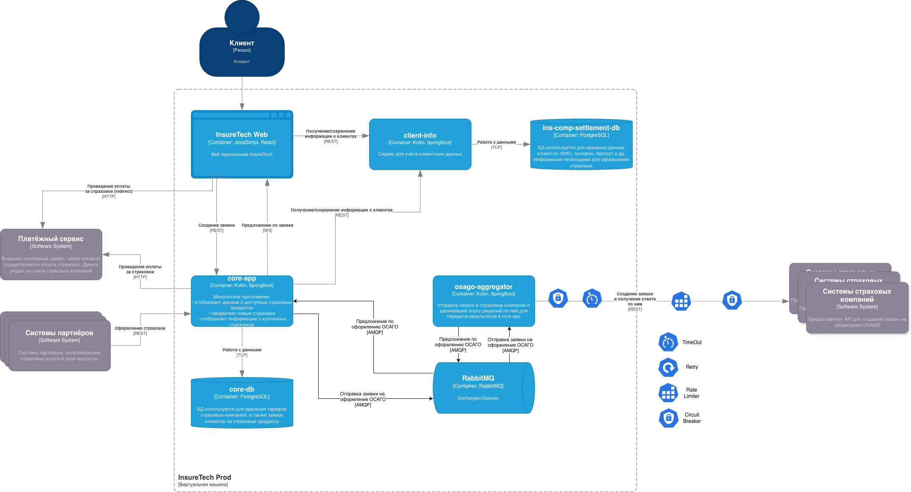

# Задание 4. Проектирование продажи ОСАГО

## Важная информация из задания

### Общая информация о сервисе

Osago-aggregator - это сервис для взаимодействия со страховыми компаниями. Функциональная обязанность этого сервиса —
отправка заявок в страховые компании и дальнейший опрос решений по ним для передачи результатов в core-app. 

Пользовательский путь: 
- клиент заполняет заявку с информацией о своём автомобиле;
- сервис запрашивает у всех доступных страховых компаний предложения с условиями страхования под заявку клиента. 

### API партнёров

Все страховые компании предоставляют однотипные REST API с двумя эндпоинтами:
- создать заявку на ОСАГО;
- получить предложение по заявке.

### Ограничения

- Ожидаемое количество одновременных пользователей в пике - 2500;
- Как только получен ответ от страховой - нужно возвращать его пользователю;
- Максимальное время ожидания решения от страховой компании — 60 секунд;

## Предлагаемое решение (ответы на вопросы)

> Какой API он предоставляет core-app? Определите средство интеграции между сервисами core-app и osago-aggregator. 

Сервис предоставляет асинхронное API для взаимодействия через RabbitMQ. Взаимодействие происходит через две очереди:
- Очередь заявок клиентов (clients_requests);
- Очередь ответов страховых (insurances_responses);

Механизм работы:
- Заявка поступает в clients_requests из сервиса core-app;
- Сервис osago-aggregator обрабатывает заявку: параллельно создаёт её в каждом из сервисов партнёров;
- После создания osago-aggregator начинает опрашивать API партнёра в течение 60 секунд;
- Как только получается получить предложение по заявке, то оно отправляется в очередь insurances_responses;
- Если за 60 секунд партнёр не ответил, то обработка заявки заканчивается;

> Требуется ли сервису своё хранилище данных? 

Нет, хранилище не требуется.

> Подумайте над API для веб-приложения в core-app. Определите средство интеграции между веб-приложением и core-app.
>
> Если будете использовать средство, отличное от REST, отразите интеграцию новой стрелкой.

В данном случае лучший вариант - это веб-сокеты.

> В зависимости от выбранных средств интеграции подумайте, требуется ли где-то применение 
паттернов отказоустойчивости: Rate Limiting, Circuit Breaker, Retry, Timeout.

Услуга будет высоко нагруженной (до 2500 одновременных пользователей), поэтому стоит применить следующие паттерны:

**Circuit Breaker** для внешних API партнёров, если API перестало отвечать, то надо перестать нагружать его.

**Rate Limiting** для внешних API партнёров, которые не могут выдерживать большой RPS.

**Timeout** для ограничения максимального времени ответа на запрос партнёром.

**Retry.** В данном случае данный паттерн будет использоваться по бизнес логике - пока не получим ответ по заявке.

## Для проверяющего

Для удобства изучения данного задания ins-product-aggregator и ins-comp-settlement из задания 3 удалёны со схемы.

